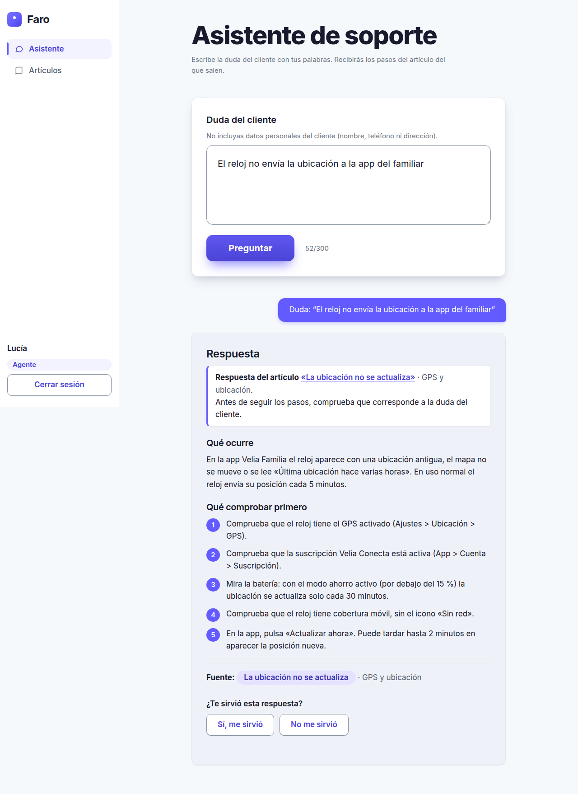
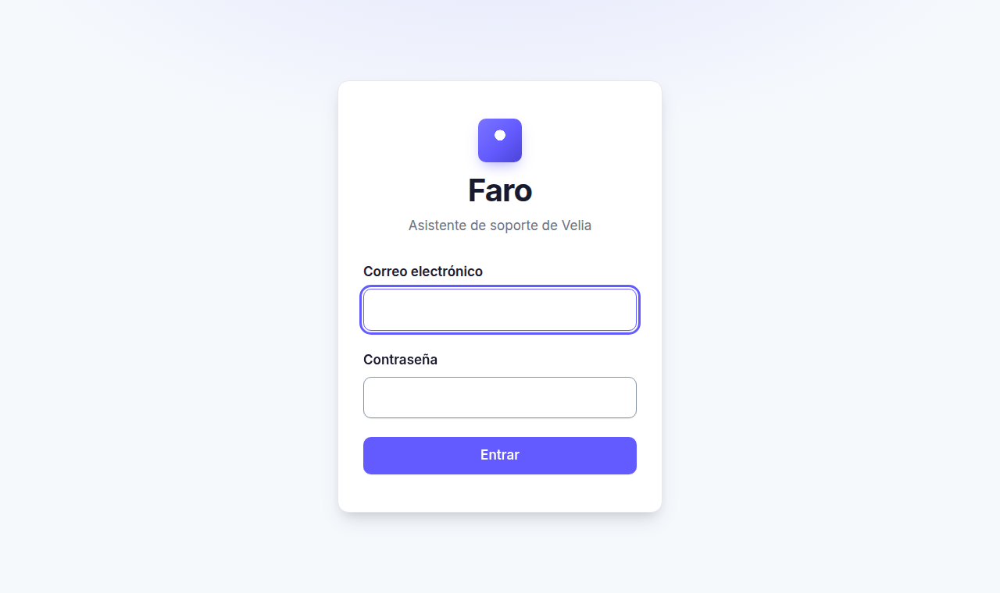
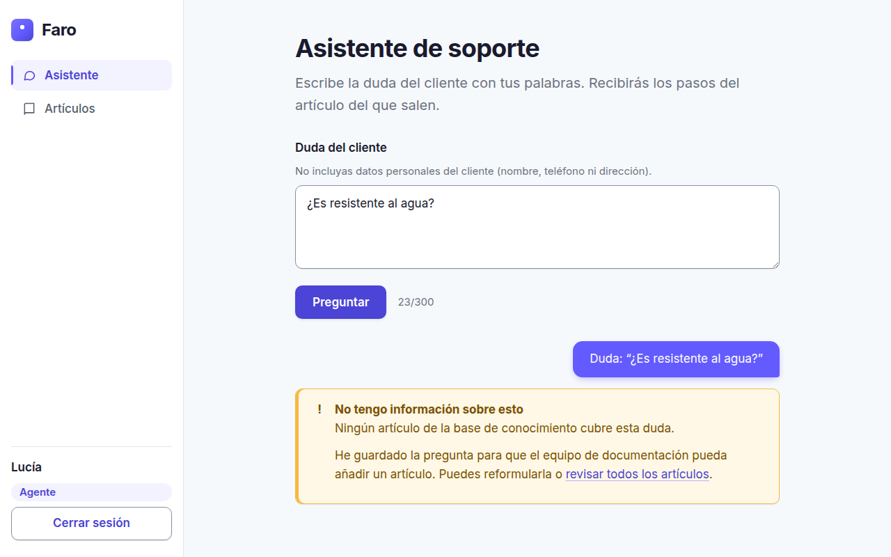
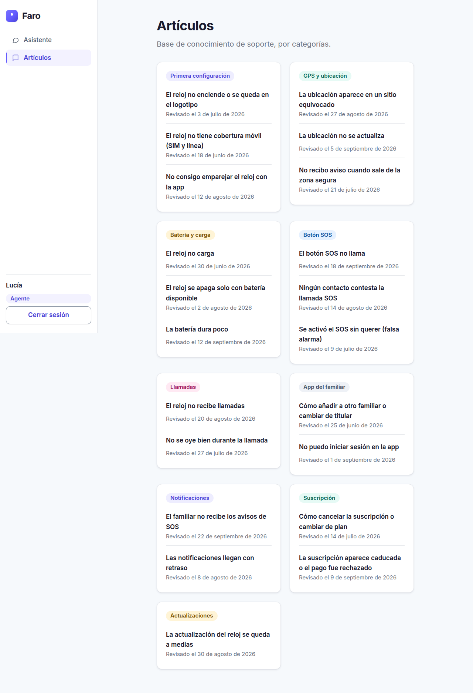
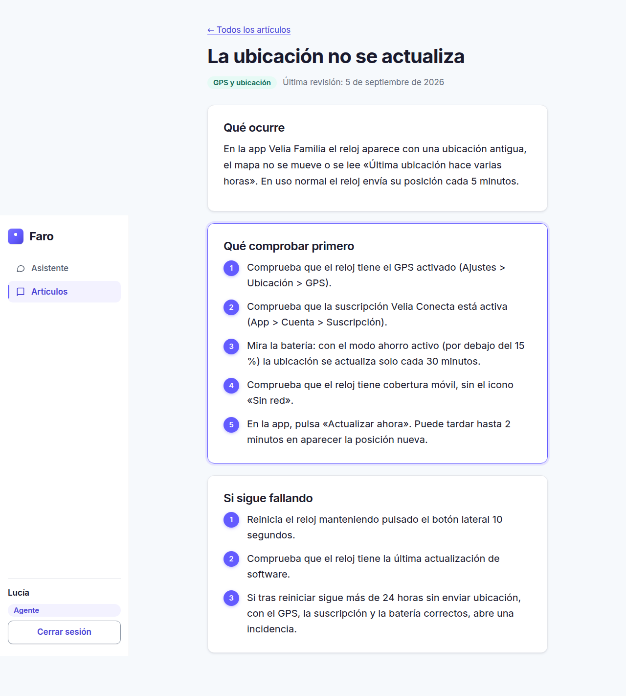
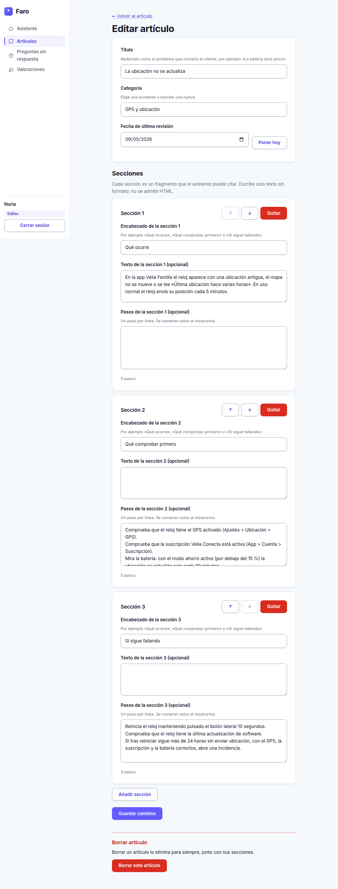
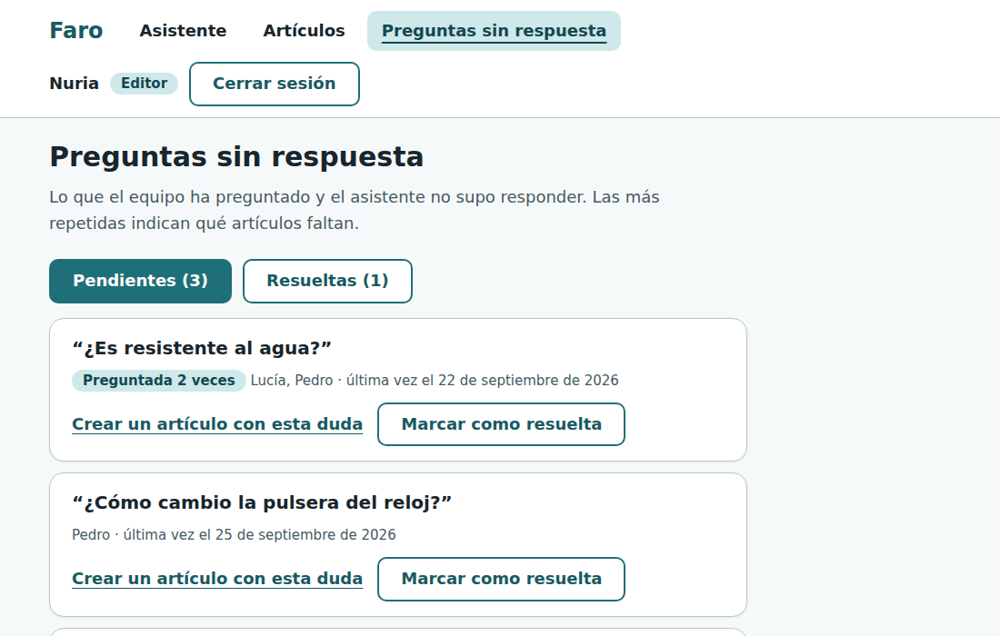
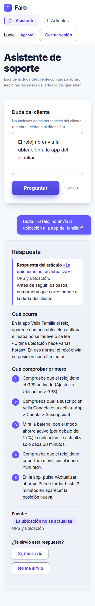

# Faro · asistente de base de conocimiento para soporte técnico

[](https://github.com/oliverx288/plants/actions/workflows/ci.yml)

Proyecto de portfolio. **Faro** ayuda a un agente de soporte a resolver una llamada rápido: escribe la duda del
cliente con sus palabras y recibe **los pasos a seguir y el artículo del que salen**, con enlace para
comprobarlo en un clic. Si no hay información, lo dice y lo apunta para que el equipo de documentación sepa qué
artículo falta.

> **La empresa es ficticia.** «Velia» vende un smartwatch con GPS y botón SOS para personas mayores, con una
> app para familiares. Todos los datos (artículos, usuarios, preguntas) son inventados.

<p align="center">
  
</p>

## Qué hace

| Rol | Usuaria de prueba | Puede |
|---|---|---|
| **Agente** | Lucía | Usar el asistente y leer artículos. **No** puede crear, editar ni borrar. |
| **Editor** | Nuria | Todo lo del agente, más crear/editar/borrar artículos y ver las **preguntas sin respuesta**. |

Los tres principios del proyecto:

- **Fiable.** El asistente nunca inventa: responde solo con texto literal de los artículos, cita siempre la
  fuente y dice «No tengo información sobre esto» cuando no encuentra nada.
- **Seguro.** Login real y permisos aplicados **en el servidor** (Row Level Security), no solo ocultando botones.
- **Sencillo y bien terminado.** Pocas funciones, todas con tests.

## Capturas

| | |
|---|---|
|  **Login** |  **«No tengo información»** (y se guarda la pregunta) |
|  **Artículos por categoría** |  **Detalle**, con la sección citada resaltada |
|  **Editor** (solo rol editor) |  **Preguntas sin respuesta**, agrupadas |

<p align="center"><br>Responsive (390 px)</p>

> Las capturas se han generado con la aplicación real y el contenido del seed, usando un cliente de Supabase
> simulado. Puedes sustituirlas por capturas de tu despliegue.

## Cómo ejecutarlo

### Requisitos
Node 20 o superior y un proyecto gratuito de [Supabase](https://supabase.com).

### 1. Instalar
```bash
npm install
```

### 2. Preparar Supabase
1. **Authentication → Sign In / Providers:** desactiva **«Allow new users to sign up»**. Solo existirán los
   usuarios del seed.
2. **SQL Editor:** ejecuta, **en este orden**, los archivos de `supabase/migrations/`:
   1. `20261004000001_schema.sql` (tablas y validaciones)
   2. `20261004000002_rls.sql` (RLS y privilegios)
   3. `20261004000003_search.sql` (búsqueda y registro de preguntas sin respuesta)
   4. `20261004000004_save_article.sql` (guardado atómico de artículos)
3. **Project Settings → API Keys:** copia la clave **pública** (anon / publishable) y la **service role** (secreta).

### 3. Variables de entorno
Copia `.env.example` a `.env` (está en `.gitignore`) y rellénalo:

| Variable | Valor |
|---|---|
| `VITE_SUPABASE_URL` | URL de tu proyecto |
| `VITE_SUPABASE_ANON_KEY` | clave **pública** |
| `SUPABASE_SERVICE_ROLE_KEY` | clave **secreta**. Solo para el seed, en tu máquina. **Nunca** con prefijo `VITE_` |
| `SEED_AGENT_PASSWORD`, `SEED_EDITOR_PASSWORD` | contraseñas de los usuarios de prueba (12+ caracteres) |

Si pones la service role en `VITE_SUPABASE_ANON_KEY`, **el build falla** y la app se niega a arrancar.

### 4. Cargar los datos y arrancar
```bash
npm run seed   # crea los 2 usuarios de prueba y 21 artículos (idempotente)
npm run dev    # http://localhost:5173
```

### Credenciales de demostración (solo demo)

| Rol | Correo | Contraseña |
|---|---|---|
| Agente (Lucía) | `lucia@velia-demo.test` | la de `SEED_AGENT_PASSWORD` |
| Editor (Nuria) | `nuria@velia-demo.test` | la de `SEED_EDITOR_PASSWORD` |

Son cuentas de un dominio inventado (`.test`). Si publicas una demo, escribe aquí las contraseñas de demo que
hayas elegido y **no uses nunca contraseñas reales**.

### Comandos

| Comando | Qué hace |
|---|---|
| `npm test` | Todas las pruebas (298, incluida una auditoría de accesibilidad con axe-core), sin necesidad de credenciales |
| `npm run reliability` | Mide la fiabilidad del asistente con 41 preguntas y muestra el porcentaje de aciertos |
| `npm run security` | Tests de seguridad: cabeceras, secretos y arnés de intrusión |
| `npm run reliability:live` | Lo mismo que `reliability`, contra **tu** Supabase real |
| `npm run security:live` | Intenta «hackear» tu Supabase real como agente y sin sesión; debe fallar todo |
| `npm run build` / `npm run lint` / `npm run typecheck` | Compilar, linter y tipos |

## Cómo funciona el asistente

No hay LLM en esta versión. Es un flujo de tres pasos (`src/assistant/`):

```
pregunta ──► 1. RECUPERAR ──► 2. FILTRAR POR RELEVANCIA ──► 3. GENERAR
            (Postgres: búsqueda   (umbral calibrado con datos;    (extractivo: copia texto
             de texto en español,  si nada lo supera NO se llama   literal del artículo y
             sin acentos, por IDF) al generador)                   cita la fuente)
                                        │
                                        └─► «No tengo información» + se guarda la pregunta
```

El paso 3 es una interfaz (`AnswerGenerator`): está preparada para conectar un LLM más adelante **sin tocar** la
recuperación ni el umbral. La guía para hacerlo con seguridad está en
[`docs/PROMPT-INJECTION.md`](docs/PROMPT-INJECTION.md).

**Fiabilidad medida** (41 preguntas, 25 con artículo y 16 sin él; detalle en [`VALIDACION.md`](VALIDACION.md)):
**85,4 %** de aciertos, **0 respuestas inventadas**, y cuando responde acierta el 90,5 %. Con 41 preguntas el
intervalo de confianza es amplio (72–93 %): léelo con cautela.

## Seguridad

El frontend solo muestra u oculta; **la base de datos decide**.

- **RLS en todas las tablas**, con privilegios mínimos (`REVOKE` + `GRANT` por columna). Solo el editor
  inserta, modifica o borra artículos; el agente no puede ascenderse a editor ni leer preguntas ajenas.
- **El rol sale de la tabla `profiles`**, no de metadatos del token (que el usuario puede editar).
- **Claves:** la service role nunca está en el frontend ni en el repositorio; el build falla si se intenta, y
  hay un test que comprueba que ningún secreto llega al JavaScript compilado.
- **Entradas validadas** en cliente y en la base de datos (`CHECK`). El contenido se muestra **siempre como
  texto**, nunca como HTML.
- **Cabeceras:** CSP estricta (sin scripts en línea ni `eval`), `nosniff`, anti-clickjacking, HSTS…
- **Prompt injection:** tratado en [`docs/PROMPT-INJECTION.md`](docs/PROMPT-INJECTION.md).

Las pruebas y sus resultados están en [`VALIDACION.md`](VALIDACION.md).

## Decisiones técnicas

| Decisión | Por qué |
|---|---|
| **Búsqueda con Postgres full-text** (no embeddings) | Sin dependencias ni LLM; se explica en una entrevista; se aplica con RLS. Coste: no entiende sinónimos (ver limitaciones) |
| **Puntuación por IDF y por campo** (título > encabezado > cuerpo) | Las palabras comunes del dominio («reloj») pesan poco; las que no aparecen en ningún artículo («garantía») bajan la puntuación y delatan una pregunta sin respuesta |
| **Umbral = evidencia absoluta**, no proporción | La proporción se solapaba entre respuestas buenas y malas; la evidencia sí separaba (ver curva en `VALIDACION.md`) |
| **Generador extractivo** | Imposible inventar: solo copia texto del artículo |
| **Artículos en secciones con pasos** | Cada sección es un fragmento citable con enlace directo (`#seccion-N`) |
| **`save_article` transaccional** | Crear/editar toca dos tablas; así no queda nada a medias si algo falla |
| **Funciones `SECURITY INVOKER`** | RLS sigue aplicando en la búsqueda y el guardado; evita `SECURITY DEFINER` y sus riesgos |
| **Comprobar filas afectadas** al borrar/actualizar | RLS bloquea con «0 filas», no con un error: sin comprobarlo se mostraría «borrado» sin serlo |
| **CSS puro con tokens** + CSS Modules | Sistema de diseño explícito y sin dependencias; contrastes WCAG AA medidos |
| **Tests con Postgres real (PGlite)** | Verifican RLS y SQL de verdad, no con simulaciones |
| **Conjunto de test retenido** | Para saber si una mejora generaliza o solo memoriza el conjunto de desarrollo |

## Estructura

```
src/
  auth/        sesión, rol desde la base de datos, guardas de ruta
  assistant/   recuperar → filtrar → generar (+ umbral)
  components/  componentes UI reutilizables y formulario del editor
  design/      tokens de diseño (color, tipografía, espaciado)
  editor/      borrador de artículo y validación
  lib/         cliente de Supabase, datos, utilidades
  pages/       pantallas
supabase/
  migrations/  esquema, RLS, búsqueda, save_article
  seed/        21 artículos ficticios y tests de contenido
  reliability/ 41 preguntas de prueba y evaluador
  tests/       tests de SQL y RLS sobre Postgres real
security/      cabeceras, secretos y pruebas de intrusión contra la API
scripts/       seed, fiabilidad y seguridad contra el Supabase real
docs/          guía de prompt injection y capturas
```

## Despliegue en Vercel

1. Importa el repositorio en Vercel (Framework: Vite; ya hay `vercel.json` con las cabeceras y la reescritura SPA).
2. En **Environment Variables** añade **solo** `VITE_SUPABASE_URL` y `VITE_SUPABASE_ANON_KEY`.
   **No añadas la service role ni las contraseñas del seed.**
3. Despliega. Si la clave pública fuera en realidad una service role, el build se cancelará.

## Limitaciones conocidas

- **Búsqueda léxica:** no entiende sinónimos («señal» ≠ «cobertura») ni erratas. Es la causa de todas las
  preguntas con artículo que no encuentra en las pruebas.
- **Pocas preguntas de prueba** (41) escritas por quien hizo el sistema: son más benévolas que las de agentes
  reales. «0 inventadas de 16» es compatible con una tasa real de hasta ~19 %.
- **Sin control de concurrencia:** si dos editores guardan el mismo artículo a la vez, gana el último.
- **Sin historial de cambios** ni auditoría de quién editó qué.
- **Sesión en `localStorage`** (comportamiento por defecto de supabase-js): mitigado con CSP y sin HTML sin sanear.
- Sin MFA ni límite de peticiones propio (solo los de Supabase Auth).

## Mejoras propuestas

Tabla de sinónimos gestionable por el editor, tolerancia a erratas, historial de cambios, conectar un LLM
siguiendo `docs/PROMPT-INJECTION.md`, y ampliar el conjunto de preguntas con casos reales del equipo.
